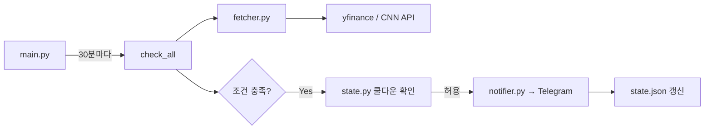

# finance-alarm 프로젝트 분석

## 1. 프로젝트 목적

**금융 시장 급변 시 텔레그램으로 자동 알림을 보내는 Python 백그라운드 서비스**입니다. PanicButtonBot 저장소의 일부로, APScheduler로 주기적으로 지표를 조회하고 임계값을 넘으면 텔레그램 봇으로 경보를 발송합니다.

| 지표 | 알람 조건 | 쿨다운 |
|------|-----------|--------|
| S&P500 (`^GSPC`) | 52주 고점 대비 **-10% 이하** | 24시간 |
| VIX (`^VIX`) | **25 이상** | 6시간 |
| Fear & Greed Index | **25 이하** (극단적 공포) | 12시간 |

설정은 `config/conditions.yaml`, 텔레그램 자격증명은 `.env`로 분리되어 있습니다.

---

## 2. 현재 파일 구조

```
finance-alarm/
├── main.py                  # 진입점 (APScheduler + 초기 1회 실행)
├── requirements.txt         # 의존성 5개
├── README.md
├── .env.example
├── .gitignore
├── config/
│   └── conditions.yaml      # 임계값, 쿨다운, 폴링 간격
└── src/
    ├── fetcher.py           # yfinance(S&P500, VIX) + CNN API(Fear&Greed)
    ├── checker.py           # ⚠️ 실제로는 테스트용 코드
    ├── temp_checker.py      # ⚠️ 실제로는 운영용 checker 로직
    ├── notifier.py          # Telegram sendMessage API
    └── state.py             # data/state.json 쿨다운 관리
```

**실행 흐름:**



**모듈 역할 요약**

- `fetcher.py` — 외부 API에서 수치 조회, 실패 시 `None`
- `state.py` — `data/state.json`에 마지막 알람 시각 저장
- `notifier.py` — HTML 포맷 텔레그램 메시지 발송
- `main.py` — UTC 기준 BlockingScheduler, 시작 시 즉시 1회 실행

---

## 3. 개선이 필요한 부분

### 🔴 치명적: checker 파일명/내용 불일치

`main.py`는 `checker`를 import하지만, **`src/checker.py`는 테스트용 코드**입니다.

```18:18:main.py
from checker import check_all  # noqa: E402 (경로 설정 후 임포트)
```

```51:55:src/checker.py
def check_all() -> None:
    """
    모든 지표를 순차적으로 확인합니다.
    조건·쿨다운을 무시하고 값이 있으면 무조건 알람을 발송합니다.
    """
```

**운영 로직(조건·쿨다운 적용)은 `src/temp_checker.py`에 있습니다.**  
현재 상태로 배포하면 30분마다 조건과 관계없이 알람이 갈 수 있습니다.

### 구조/운영

| 항목 | 현재 | 개선 방향 |
|------|------|-----------|
| 패키지 구조 | `sys.path.insert` + 상대 import | `src` 패키지화 또는 `pyproject.toml` |
| 로깅 | `print()`만 사용 | `logging` 모듈 + 파일/로테이션 |
| 테스트 | 없음 | fetcher mock, checker 단위 테스트 |
| 배포 | README에 nohup/systemd만 언급 | systemd unit, Dockerfile, CI |
| 설정 검증 | 시작 시 `.env` 미검증 | startup 시 token/chat_id/YAML 검증 |
| API 재시도 | 없음 | fetcher/telegram에 retry + backoff |
| 의존성 | 버전만 고정 | Python `>=3.10` 명시, lock file |

### 코드 품질

- `CONFIG_PATH`가 `main.py`, checker 계열에 중복
- `_format_message`의 `condition` 인자 미사용 (`temp_checker.py`)
- `state.py`에 파일 잠금 없음 → 다중 인스턴스 시 race condition 가능
- 테스트용 `checker.py`와 운영용 `temp_checker.py` 네이밍 정리 필요

---

## 4. 잠재적인 버그

### 🔴 Bug #1: 운영 코드가 연결되지 않음 (위와 동일)

`main.py` → `checker.py`(테스트) 연결. **배포 전 반드시 수정 필요.**

### 🟠 Bug #2: 테스트 모드의 알람 폭주

테스트 checker는 쿨다운·임계값을 무시하므로, enabled 지표마다 폴링마다 알람이 발송됩니다.

### 🟠 Bug #3: `state.py` timezone 비교

```46:48:src/state.py
    last_alerted = datetime.fromisoformat(last_alerted_str)
    now = datetime.now(timezone.utc)
    elapsed_hours = (now - last_alerted).total_seconds() / 3600
```

`state.json`에 timezone 없는 ISO 문자열이 있으면 aware/naive 비교로 `TypeError` 가능.

### 🟡 Bug #4: 알람 실패 시 쿨다운 미기록

운영 checker는 `send_telegram` 성공 시에만 `mark_alerted` 호출 → 설계상 맞지만, Telegram API 장애 시 매 폴링마다 재시도합니다.

### 🟡 Bug #5: 외부 API 의존성

- **yfinance `ticker.info`**: Yahoo rate limit, 필드 누락, 응답 지연
- **CNN Fear & Greed**: 비공식 API, JSON 구조 변경 시 `KeyError`

### 🟡 Bug #6: S&P500 데이터 일관성

`regularMarketPrice`와 `previousClose`를 혼용해 장중/장외 시점이 달라질 수 있습니다.

### 🟡 Bug #7: HTML parse_mode

Telegram `parse_mode: HTML` 사용. 현재는 숫자만 출력해 안전하지만, 향후 문자열 추가 시 이스케이프 필요.

### 🟡 Bug #8: `conditions.yaml`의 `condition` 필드

`drop_from_above`, `above`, `below`가 YAML에만 있고 코드에서 읽지 않음. 비교 로직은 하드코딩.

---

## 5. 배포 전 체크리스트

### 필수 (배포 차단)

- [ ] **`main.py` import 수정** — `temp_checker`가 아닌 운영용 `checker` 연결
- [ ] **파일 정리** — `checker.py` ↔ `temp_checker.py` 내용/이름 정리, 테스트는 `checker_test.py` 등으로 분리
- [ ] **`.env` 설정** — `TELEGRAM_BOT_TOKEN`, `TELEGRAM_CHAT_ID` 확인
- [ ] **Telegram 연동 테스트** — `getUpdates`로 chat_id 확인, 테스트 메시지 1건 발송
- [ ] **운영 모드 동작 확인** — 임계값을 일부러 넘지 않을 때 알람이 **가지 않는지** 확인
- [ ] **쿨다운 확인** — 조건 충족 후 재알람까지 설정 시간(6h/12h/24h) 대기 또는 `state.json`으로 검증

### 환경/인프라

- [ ] Python 3.10+ (타입 힌트 `float | None` 사용)
- [ ] `pip install -r requirements.txt` 완료
- [ ] `config/conditions.yaml` 임계값·enabled·`interval_minutes` 최종 확인
- [ ] `data/` 디렉터리 쓰기 권한 확인
- [ ] **단일 인스턴스**만 실행 (중복 실행 방지)
- [ ] 프로세스 관리: systemd / tmux / nohup 중 하나 선택
- [ ] 서버 timezone UTC 또는 로그에 UTC 명시 (현재 UTC 사용)

### 네트워크/외부 의존성

- [ ] Yahoo Finance 접근 가능 (`^GSPC`, `^VIX`)
- [ ] CNN Fear & Greed API 접근 가능
- [ ] `api.telegram.org` 접근 가능
- [ ] 방화벽/프록시에서 HTTPS outbound 허용

### 모니터링/복구

- [ ] 로그 확인 방법 (stdout → journald 또는 파일)
- [ ] 프로세스 crash 시 자동 재시작 (`Restart=always`)
- [ ] `data/state.json` 백업/초기화 방법 문서화 (README에 있음)
- [ ] API 장애 시 알람 미발송 대비 — health check 또는 heartbeat 알림 검토

### 보안

- [ ] `.env`가 git에 포함되지 않았는지 확인 (`.gitignore`에 있음)
- [ ] Bot token 노출 시 BotFather에서 revoke 가능한지 확인

---

## 요약

소규모이지만 역할 분리(fetch / check / notify / state)는 잘 되어 있습니다. README와 YAML 기반 설정도 실용적입니다.

**가장 시급한 문제는 `main.py`가 테스트용 `checker.py`를 import하고, 운영 로직이 `temp_checker.py`에 있다는 점입니다.** 이 상태로 배포하면 조건·쿨다운 없이 반복 알람이 갈 수 있습니다.

원하시면 다음 단계로 파일 정리와 import 수정, startup 검증, systemd unit 예시까지 바로 진행할 수 있습니다.
